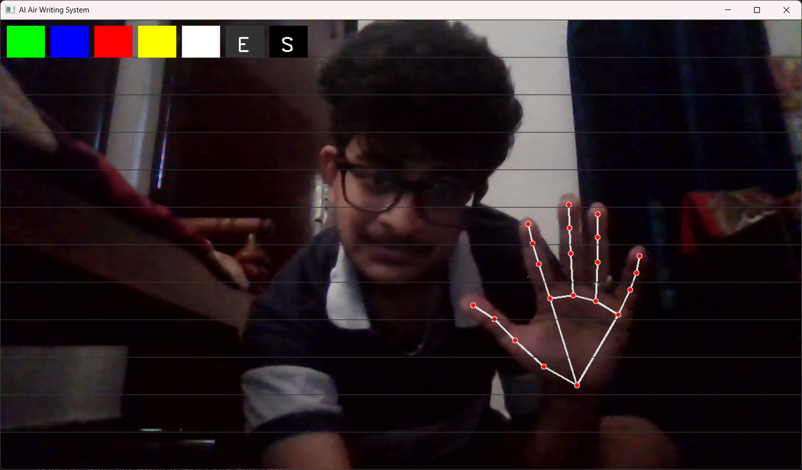
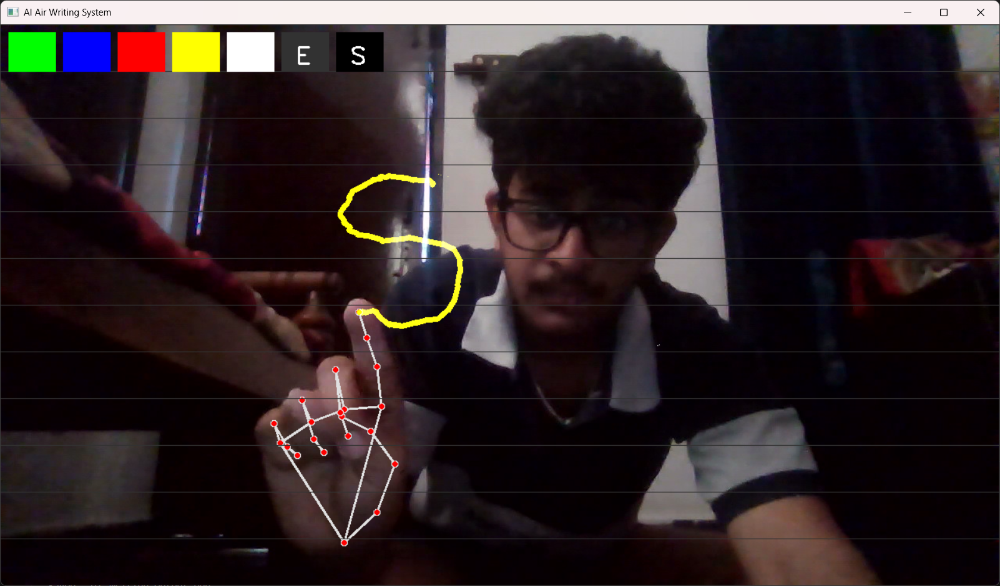
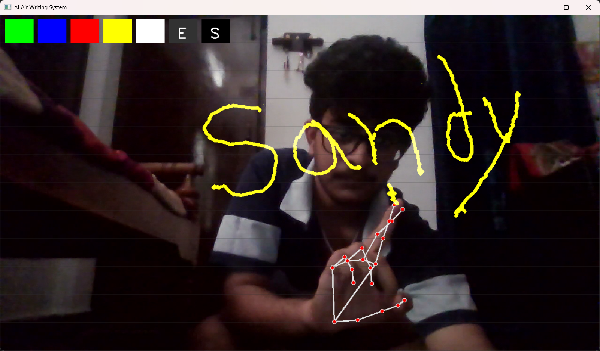

# ✋ Air Writing

Air Writing is a touchless writing system that allows users to write on the screen using **hand gestures** captured through a webcam.

---

## ✋ Hand Signs / Gestures

| Hand Sign | Gesture Description | Action |
|---------|--------------------|--------|
| ☝ Index Finger Up | Only index finger raised | Write / Draw |
| ✌ Index + Middle Fingers Up | Two fingers raised | Pause drawing |
| ✊ Fist | All fingers closed | Erase |
| 👆 Index Finger Hover on Toolbar | Finger over toolbar icons | Select color / tool |
| 🖐 Hover on Save Icon | Hand over save icon | Save drawing |

---

## ⌨ Keyboard Controls

| Key | Action |
|----|-------|
| **T** | OCR (convert drawing to text output) |
| **Q** | Exit application |

---

## 📝 Notes

- Gestures are detected using AI-based hand landmark detection.
- The system works in real time using a webcam.
- No mouse or keyboard is required for writing.

---
## 📸 Screenshots

### Air Writing – Main View

### Air Writing – Toolbar & Colors

### Air Writing – Drawing & Erasing

---
## 🎥 Demo Video

▶️ **Watch the Demo on YouTube**  
https://youtu.be/fStXm1T_ARM